```mermaid
graph TD
    A[Land on Homepage] --> B{Interested?}
    B -->|Yes| C[Click Download CTA]
    B -->|No| D[Leave Site]

    C --> E[Download Page]
    E --> F{Check System Requirements}
    F -->|Compatible| G[Download Installer]
    F -->|Incompatible| H[Show Error: Windows 10/11 Required]

    G --> I[Install VoiceLite.exe]
    I --> J[Launch App]
    J --> K[See Purchase Prompt]

    K --> L{Ready to Buy?}
    L -->|Not Yet| M[Close App]
    L -->|Yes| N[Click Purchase in App OR Return to Website]

    N --> O[Pricing Page/Stripe Checkout]
    O --> P[Enter Payment Info]
    P --> Q{Payment Success?}
    Q -->|Yes| R[Receive License Key via Email]
    Q -->|No| S[Show Error, Retry Payment]

    R --> T[Copy License Key]
    T --> U[Paste in App Settings]
    U --> V[License Validated ✓]
    V --> W[Full Access Unlocked]
```

# VoiceLite UI/UX Specification

**Version:** 1.0
**Last Updated:** 2025-01-14
**Status:** Draft
**Author:** UX Expert (Sally)

---

## Table of Contents

1. [Introduction](#introduction)
2. [Information Architecture](#information-architecture)
3. [User Flows](#user-flows)
4. [Wireframes & Mockups](#wireframes--mockups)
5. [Component Library](#component-library)
6. [Branding & Style Guide](#branding--style-guide)
7. [Accessibility Requirements](#accessibility-requirements)
8. [Responsiveness Strategy](#responsiveness-strategy)
9. [Animation & Micro-interactions](#animation--micro-interactions)
10. [Next Steps](#next-steps)

---

## 1. Introduction

This document defines the user experience goals, information architecture, user flows, and visual design specifications for VoiceLite's marketing website user interface. It serves as the foundation for visual design and frontend development, ensuring a cohesive and user-centered experience.

### 1.1 Overall UX Goals & Principles

#### Target User Personas

1. **Productivity Enthusiast**
   - Technical writers, journalists, content creators who type 5,000+ words/day
   - Values: Speed, accuracy, seamless workflow integration
   - Pain: Repetitive typing strain, slow manual transcription

2. **Accessibility User**
   - Users with mobility limitations, RSI, or typing disabilities
   - Values: Reliability, privacy, ease of use
   - Pain: Physical barriers to computer interaction

3. **Busy Professional**
   - Developers, executives, knowledge workers who need quick note capture
   - Values: "Just works" simplicity, one-time cost (no subscriptions)
   - Pain: Complex tools with learning curves, recurring costs

#### Usability Goals

1. **Instant comprehension**: Visitor understands what VoiceLite does within 3 seconds
2. **Trust building**: Clear privacy messaging, transparent pricing, no dark patterns
3. **Frictionless purchase**: Download-to-payment flow takes < 60 seconds
4. **Technical clarity**: Model comparison is understandable without AI expertise

#### Design Principles

1. **Radical Simplicity** - Like the product itself, the website should be effortlessly simple
2. **Privacy First** - Make privacy features visible and prominent (no analytics, local processing)
3. **Show, Don't Tell** - Use demos/videos over lengthy descriptions
4. **Honest & Direct** - No marketing fluff, straightforward value proposition
5. **Fast & Light** - Website should load instantly, reflect product performance values

---

## 2. Information Architecture

### 2.1 Site Map / Screen Inventory


### 2.2 Navigation Structure

**Primary Navigation (Top Header):**
Clean, minimal horizontal nav with 4-5 main items:
- **Home** (VoiceLite logo, clickable)
- **Features** (dropdown: Core Features, Privacy, Model Comparison)
- **Pricing** ($20 prominently displayed)
- **Docs** (dropdown: Getting Started, FAQ, Troubleshooting)
- **Download** (CTA button, visually distinct - accent color)

**Secondary Navigation:**
- Footer only: About, Privacy Policy, Terms, Support/Contact, GitHub link

**Breadcrumb Strategy:**
- Not needed for marketing site (flat hierarchy, max 2 levels deep)
- Use clear "Back to Home" links on detail pages instead

---

## 3. User Flows

### 3.1 Flow: First-Time Download & Purchase

**User Goal:** Download VoiceLite, understand value, and complete purchase

**Entry Points:**
- Homepage CTA ("Download Now")
- Navigation "Download" button
- Pricing page "Buy Now" button

**Success Criteria:** User successfully downloads installer, completes $20 payment, and receives license key

#### Flow Diagram



#### Edge Cases & Error Handling

- **Incompatible OS (Mac/Linux)**: Show clear "Windows only" message with OS detection
- **Download fails**: Provide alternative download link (Google Drive backup)
- **Payment fails**: Clear error messages, support contact info
- **Email not received**: "Didn't get your key?" link → resend page
- **Invalid license key**: Auto-validate format, show helpful error messages
- **Offline activation**: Allow grace period for license validation

**Notes:**
- License delivery must be instant (email sent within 30 seconds of payment)
- Consider showing preview video on download page to build confidence

---

### 3.2 Flow: Feature Research (Comparison Shopping)

**User Goal:** Understand if VoiceLite fits their needs vs. competitors

**Entry Points:**
- Homepage "Features" navigation
- Homepage scroll (feature section)
- Search engines (landing on Features page)

**Success Criteria:** User feels confident VoiceLite solves their problem better than alternatives

#### Flow Diagram


#### Edge Cases & Error Handling

- **Technical jargon confusion**: Provide tooltip definitions for AI terms (Whisper, model size, beam search)
- **Comparison to specific competitor**: Add "vs. Dragon NaturallySpeaking" or "vs. Otter.ai" FAQ
- **Niche use case**: Expand FAQ with specific scenarios (coding, medical transcription, gaming)

**Notes:**
- Model comparison should use simple language ("Small = fast & accurate enough for most users")
- Include actual accuracy percentages and speed benchmarks from docs

---

### 3.3 Flow: Troubleshooting Post-Purchase

**User Goal:** Solve technical issue after purchasing/installing

**Entry Points:**
- App error messages (link to docs)
- Google search for error
- Support page navigation

**Success Criteria:** User resolves issue without contacting support

#### Flow Diagram


#### Edge Cases & Error Handling

- **VCRUNTIME140_1.dll error**: Prominent solution (VC++ Redistributable download)
- **Microphone not detected**: Step-by-step audio troubleshooting guide
- **License validation fails**: Offline mode instructions, support escalation
- **App won't start**: Safe mode / reinstall instructions

**Notes:**
- Top 5 issues should be above the fold on troubleshooting page
- Each solution should have success confirmation ("Did this fix your issue?")

---

## 4. Wireframes & Mockups

### 4.1 Primary Design Files

**Design Tool:** TBD (Figma recommended, or use AI tools like v0.dev/Lovable)

**Design File Link:** [To be added after design work]

---

### 4.2 Key Screen Layouts

#### Screen 1: Homepage (Hero Section)

**Purpose:** Hook visitors in 3 seconds, drive to download/purchase

**Key Elements:**

1. **Above the Fold (Hero):**
   - **Headline:** "Stop Typing. Start Speaking." (Bold, 48-64px)
   - **Subheadline:** "VoiceLite turns your voice into text instantly—anywhere on Windows. Private, fast, and $20 one-time." (24px)
   - **Demo Video:** 45-60 sec autoplay loop (muted), centered, 60% width
   - **Primary CTA:** "Download for Windows" (Large button, accent color, 18px font)
   - **Secondary CTA:** "See Pricing" (Text link or ghost button)
   - **Trust Signal:** "No subscription. No tracking. Yours forever." (Small text under CTAs)

2. **Social Proof Strip (below hero):**
   - GitHub stars count
   - "1000+ users" (if applicable)
   - "100% private—data never leaves your PC"

3. **Feature Highlights (3 columns):**
   - 🔒 **Privacy First** - "No cloud, no tracking, fully offline"
   - ⚡ **Works Everywhere** - "Email, code, Slack, Discord—any Windows app"
   - 💰 **One-Time $20** - "No subscription. Pay once, use forever."

4. **How It Works (3 steps with icons):**
   - Step 1: Press hotkey (keyboard icon)
   - Step 2: Speak naturally (microphone icon)
   - Step 3: Text appears instantly (checkmark icon)

5. **Model Comparison Table:**
   - Header: "Choose Your Accuracy Level"
   - 5 models (Tiny → Large) with accuracy %, speed, size
   - Note: "All models included with $20 purchase"

6. **Final CTA Section:**
   - Headline: "Ready to 10x your productivity?"
   - CTA: "Download VoiceLite for $20"
   - Subtext: "Windows 10/11 • 30-day money-back guarantee"

**Interaction Notes:**
- Video should pause on hover (accessibility)
- CTAs should have hover states (lift/shadow effect)
- Smooth scroll to sections when clicking navigation
- Model comparison table should be sortable (by accuracy/speed)

---

#### Screen 2: Download Page

**Purpose:** Ensure system compatibility, provide download options, set expectations

**Key Elements:**

1. **Download Hero:**
   - Headline: "Download VoiceLite"
   - System requirement check (auto-detect OS, show warning if Mac/Linux)

2. **Primary Download Button:**
   - "Download VoiceLite-Setup-1.0.66.exe" (540MB)
   - Version number visible
   - Virus scan badge (VirusTotal link)

3. **Alternative Download:**
   - "Mirror: Google Drive" (backup if GitHub slow)

4. **What Happens Next:**
   - Step 1: Run installer (requires admin)
   - Step 2: Launch VoiceLite
   - Step 3: Purchase license for $20
   - Step 4: Enter license key

5. **System Requirements (Expandable):**
   - Windows 10/11 (64-bit)
   - 4GB RAM minimum, 8GB recommended
   - 2GB disk space
   - Microphone (USB or built-in)

6. **Troubleshooting Links:**
   - "VCRUNTIME140_1.dll error?" → VC++ download
   - "Installer won't run?" → Windows Defender instructions

**Interaction Notes:**
- Auto-detect OS, show warning banner if not Windows
- Download button should show progress (if browser supports)
- "What Happens Next" should expand/collapse on mobile

---

#### Screen 3: Pricing Page

**Purpose:** Justify $20 value, show what's included, handle objections

**Key Elements:**

1. **Pricing Hero:**
   - "$20. One-Time. Yours Forever."
   - Subtext: "No subscription. No recurring charges. Lifetime updates."

2. **What's Included (Checklist):**
   - ✅ All 5 AI models (Tiny → Large)
   - ✅ Lifetime updates
   - ✅ Works in unlimited apps
   - ✅ 100% offline privacy
   - ✅ 30-day money-back guarantee
   - ✅ Email support

3. **Comparison to Competitors:**

| Feature | VoiceLite | Dragon ($500) | Otter.ai ($204/yr) |
|---------|-----------|---------------|-------------------|
| Price | **$20 once** | $500 | $17/mo |
| Privacy | **100% local** | Local | Cloud |
| Platform | Windows | Win/Mac | Web |

4. **Payment Options:**
   - "Buy Now" CTA → Stripe Checkout
   - Accepted: Credit/Debit, Apple Pay, Google Pay
   - Secure badge (SSL, Stripe verified)

5. **FAQ (Inline):**
   - "Can I get a refund?" → Yes, 30 days
   - "Do I need internet?" → Only for initial purchase
   - "Will it work on Mac?" → No, Windows only

**Interaction Notes:**
- "Buy Now" button should be sticky on scroll (mobile)
- Comparison table should highlight VoiceLite column
- FAQ should expand/collapse on click

---

#### Screen 4: Features Page

**Purpose:** Deep dive into capabilities, answer "Can it do X?" questions

**Key Elements:**

1. **Feature Hero:**
   - Headline: "Designed for Privacy, Built for Speed"
   - Video/GIF showing feature in action

2. **Feature Categories (Tabs or Accordion):**

   **Tab 1: Core Features**
   - Push-to-talk recording (hotkey)
   - Instant transcription (<200ms)
   - Auto-paste to any app
   - Transcription history panel

   **Tab 2: Privacy & Security**
   - 100% offline processing
   - No analytics, no tracking
   - Audio deleted immediately
   - Open-source code (link to GitHub)

   **Tab 3: AI Models**
   - Model comparison table (detailed version)
   - Accuracy benchmarks
   - Speed comparisons
   - Disk space requirements

   **Tab 4: Compatibility**
   - Works in: Notepad, VS Code, Slack, Discord, Gmail, Word, etc.
   - System requirements
   - Language support (99 languages via Whisper)

3. **Use Cases (Visual Grid):**
   - Content writers: "Write 5,000 words/day hands-free"
   - Developers: "Code faster with voice commands"
   - Accessibility: "Type without typing"

**Interaction Notes:**
- Tabs should be sticky when scrolling within content
- Each feature should have a visual (screenshot or icon)
- Use cases should link to relevant docs/tutorials

---

#### Screen 5: FAQ / Docs Landing

**Purpose:** Self-service support, reduce support emails

**Key Elements:**

1. **Search Bar:**
   - Large, prominent search
   - Placeholder: "Search for help... (e.g., 'microphone not working')"

2. **Quick Links (Cards):**
   - 🚀 Getting Started
   - 🔧 Troubleshooting
   - 🎤 Microphone Setup
   - 🔑 License Activation

3. **Popular Questions:**
   - Accordion-style FAQ
   - Top 10 most common questions from docs

4. **Still Need Help?:**
   - Contact form
   - Expected response time: 24 hours
   - Link to GitHub issues (for technical users)

**Interaction Notes:**
- Search should show instant results as you type
- FAQ accordion should support deep linking (URL fragments)
- Contact form should validate email format

---

## 5. Component Library / Design System

### 5.1 Design System Approach

**Approach:** Build a custom, lightweight design system tailored for VoiceLite

**Rationale:**
- Pre-built systems (Material, Bootstrap) feel generic for a product-focused site
- Custom system allows brand personality (privacy-focused, technical, trustworthy)
- Lightweight = faster load times (aligns with product values)
- Component reuse across marketing site and future docs/blog

**Framework Recommendation:**
- **Tailwind CSS v4** (already in stack)
- **shadcn/ui** components (optional, if you want pre-built React components)
- **Radix UI** primitives for accessibility (headless components)

---

### 5.2 Core Components

#### Component 1: Button

**Purpose:** Primary/secondary actions throughout the site

**Variants:**
- **Primary:** Main CTAs (Download, Buy Now)
- **Secondary:** Lower-priority actions (Learn More, See Docs)
- **Ghost:** Tertiary actions (text links with hover state)
- **Danger:** Destructive actions (Delete account - future)

**States:**
- Default
- Hover (lift + shadow)
- Active (pressed)
- Disabled (grayed out, no interaction)
- Loading (spinner icon)

**Usage Guidelines:**
- Max 1 primary button per viewport
- Primary buttons use accent color
- Minimum touch target: 44x44px (mobile accessibility)
- Always include hover/focus states for keyboard users

**Example Code (Tailwind):**
```tsx
// Primary Button
<button className="bg-accent-600 hover:bg-accent-700 text-white font-semibold px-6 py-3 rounded-lg shadow-md hover:shadow-lg transition-all duration-200">
  Download Now
</button>

// Secondary Button
<button className="bg-transparent border-2 border-neutral-300 hover:border-accent-600 text-neutral-700 hover:text-accent-600 font-semibold px-6 py-3 rounded-lg transition-all duration-200">
  Learn More
</button>
```

---

#### Component 2: Card

**Purpose:** Feature highlights, use cases, FAQ items

**Variants:**
- **Feature Card:** Icon + headline + description
- **Pricing Card:** Plan comparison (if multiple tiers in future)
- **Testimonial Card:** Quote + author + avatar
- **Stat Card:** Large number + label (e.g., "1000+ users")

**States:**
- Default
- Hover (subtle lift)
- Active/Selected (border highlight)

**Usage Guidelines:**
- White background with subtle border (not heavy drop shadow)
- Consistent padding (24px on desktop, 16px mobile)
- Icons should be 48x48px for feature cards
- Max 3 cards per row on desktop

---

#### Component 3: Navigation Bar

**Purpose:** Global navigation across all pages

**Variants:**
- **Desktop:** Horizontal layout with dropdowns
- **Mobile:** Hamburger menu with slide-out drawer

**States:**
- Default
- Hover (underline or highlight)
- Active page (bold or accent color)
- Scrolled (sticky nav with shadow)

**Usage Guidelines:**
- Sticky on scroll (always accessible)
- Logo left, nav center, CTA button right
- Transparent background on hero, white on scroll
- Mobile menu should overlay content (not push)

---

#### Component 4: Input Fields

**Purpose:** Forms (contact, license activation, search)

**Variants:**
- **Text Input:** Standard text entry
- **Email Input:** With validation
- **Search Input:** With icon and autocomplete
- **Textarea:** Multi-line (support messages)

**States:**
- Default (empty)
- Focus (border highlight)
- Filled (has value)
- Error (red border + error message)
- Success (green border + checkmark)
- Disabled (grayed out)

**Usage Guidelines:**
- Always include labels (accessibility)
- Inline validation (show errors on blur)
- Placeholder text should be example, not instruction
- 16px font size minimum (prevents iOS zoom)

---

#### Component 5: Video Player

**Purpose:** Hero demo video, feature videos

**Variants:**
- **Hero Video:** Autoplay, muted, loop, no controls
- **Feature Video:** User-initiated, with controls
- **Thumbnail Video:** Preview on hover

**States:**
- Loading (skeleton or spinner)
- Playing
- Paused
- Error (fallback image)

**Usage Guidelines:**
- Autoplay only if muted (browser policy)
- Include play/pause button overlay (accessibility)
- Provide fallback image if video fails
- Lazy load below-the-fold videos

---

#### Component 6: Accordion (FAQ)

**Purpose:** Expandable FAQ items, feature details

**Variants:**
- **Single:** Only one open at a time
- **Multiple:** Multiple can be open simultaneously

**States:**
- Collapsed (default)
- Expanded (show content)
- Hover (highlight clickable area)

**Usage Guidelines:**
- Use chevron icon to indicate expand/collapse
- Smooth animation (200ms ease)
- Support keyboard navigation (Space/Enter to toggle)
- Deep linking (URL fragments like #faq-refund)

---

#### Component 7: Modal / Dialog

**Purpose:** Purchase flow, confirmations, video player

**Variants:**
- **Small:** Confirmations (400px width)
- **Medium:** Forms, content (600px width)
- **Large:** Video player, detailed content (800px width)

**States:**
- Hidden
- Visible (with backdrop overlay)
- Loading (spinner in content area)

**Usage Guidelines:**
- Backdrop should dim content (rgba(0,0,0,0.5))
- Close on Escape key or click outside (accessibility)
- Focus trap (keyboard navigation stays in modal)
- Smooth fade-in animation (200ms)

---

#### Component 8: Table

**Purpose:** Model comparison, pricing comparison, feature matrix

**Variants:**
- **Standard:** Basic rows/columns
- **Comparison:** Highlight one column (VoiceLite)
- **Sortable:** Clickable headers to sort

**States:**
- Default
- Row hover (subtle highlight)
- Column highlight (for comparison)

**Usage Guidelines:**
- Responsive: Convert to cards on mobile (<768px)
- Sticky header on scroll (long tables)
- Zebra striping for readability (alternating row colors)
- Highlight key column with subtle background

---

#### Component 9: Badge / Tag

**Purpose:** Status indicators, labels, version numbers

**Variants:**
- **Info:** Neutral information (blue)
- **Success:** Positive status (green)
- **Warning:** Caution (yellow)
- **Danger:** Error or critical (red)
- **Neutral:** Generic labels (gray)

**Usage Guidelines:**
- Small text (12-14px)
- Pill-shaped (rounded corners)
- Subtle background, contrasting text
- Use sparingly (loses impact if overused)

---

## 6. Branding & Style Guide

### 6.1 Visual Identity

**Brand Guidelines:** [To be created - this spec serves as the foundation]

**Brand Personality:**
- **Trustworthy** - Privacy-focused, reliable, no dark patterns
- **Technical** - Powered by cutting-edge AI, for serious users
- **Approachable** - Simple to use, not intimidating despite technical power
- **Premium** - $20 product should feel high-quality, not cheap

**Brand Voice:**
- Direct and honest (no marketing fluff)
- Technically accurate (cite real stats: "90-98% accuracy")
- Empowering ("10x your productivity", "stop typing")
- Privacy-conscious ("100% offline", "data never leaves your PC")

---

### 6.2 Color Palette

| **Color Type** | **Hex Code** | **Tailwind** | **Usage** |
|---|---|---|---|
| **Primary** | `#2563EB` | `blue-600` | Main CTAs, links, brand color |
| **Primary Dark** | `#1E40AF` | `blue-800` | Hover states, headers |
| **Primary Light** | `#DBEAFE` | `blue-50` | Backgrounds, subtle highlights |
| **Accent** | `#10B981` | `emerald-500` | Success states, "Buy Now" button |
| **Accent Dark** | `#059669` | `emerald-600` | Accent hover states |
| **Warning** | `#F59E0B` | `amber-500` | Cautions, system requirements |
| **Error** | `#EF4444` | `red-500` | Errors, validation issues |
| **Neutral 900** | `#111827` | `gray-900` | Primary text, headlines |
| **Neutral 700** | `#374151` | `gray-700` | Body text |
| **Neutral 500** | `#6B7280` | `gray-500` | Secondary text, placeholders |
| **Neutral 300** | `#D1D5DB` | `gray-300` | Borders, dividers |
| **Neutral 100** | `#F3F4F6` | `gray-100` | Backgrounds, cards |
| **Neutral 50** | `#F9FAFB` | `gray-50` | Page background |
| **White** | `#FFFFFF` | `white` | Cards, modals, navigation |
| **Black** | `#000000` | `black` | Overlay shadows (rgba) |

**Color Usage Rules:**
1. **Primary blue** for brand elements (logo, main CTAs, links)
2. **Accent green** for purchase CTAs only ("Buy Now", "Download")
3. **Neutral 900** for all body text (maximum readability)
4. **Neutral 300** for borders (subtle, not heavy)
5. **White backgrounds** for content cards, **Neutral 50** for page background

---

### 6.3 Typography

#### 6.3.1 Font Families

**Primary (Sans-Serif):** [Inter](https://fonts.google.com/specimen/Inter)
- **Why:** Modern, highly readable, excellent for UI, open-source, optimized for screens
- **Weights:** 400 (Regular), 600 (Semibold), 700 (Bold)
- **Usage:** All body text, headlines, UI elements

**Secondary (Sans-Serif):** System font stack fallback
- **Fallback:** `-apple-system, BlinkMacSystemFont, "Segoe UI", Roboto, Oxygen, Ubuntu, Cantarell`
- **Why:** Fast loading, native feel if Inter fails

**Monospace:** [JetBrains Mono](https://fonts.google.com/specimen/JetBrains+Mono)
- **Why:** Technical audience, excellent for code snippets, license keys
- **Weights:** 400 (Regular), 500 (Medium)
- **Usage:** License keys, technical specs, code examples (if docs site)

---

#### 6.3.2 Type Scale

| **Element** | **Size** | **Weight** | **Line Height** | **Tailwind Class** |
|---|---|---|---|---|
| **H1 (Hero)** | 48px (3rem) | 700 (Bold) | 1.2 (58px) | `text-5xl font-bold leading-tight` |
| **H2 (Section)** | 36px (2.25rem) | 700 (Bold) | 1.3 (47px) | `text-4xl font-bold leading-snug` |
| **H3 (Subsection)** | 24px (1.5rem) | 600 (Semibold) | 1.4 (34px) | `text-2xl font-semibold leading-normal` |
| **H4 (Card Title)** | 20px (1.25rem) | 600 (Semibold) | 1.5 (30px) | `text-xl font-semibold leading-relaxed` |
| **Body Large** | 18px (1.125rem) | 400 (Regular) | 1.6 (29px) | `text-lg font-normal leading-relaxed` |
| **Body** | 16px (1rem) | 400 (Regular) | 1.6 (26px) | `text-base font-normal leading-relaxed` |
| **Small** | 14px (0.875rem) | 400 (Regular) | 1.5 (21px) | `text-sm font-normal leading-normal` |
| **Tiny (Caption)** | 12px (0.75rem) | 400 (Regular) | 1.4 (17px) | `text-xs font-normal leading-snug` |

**Typography Rules:**
1. **Max line length:** 65-75 characters for body text (optimal readability)
2. **Minimum body size:** 16px (prevents iOS zoom on focus)
3. **Generous line height:** 1.6 for body text (easier scanning)
4. **Hierarchy:** Use size AND weight to establish importance
5. **Mobile scaling:** Reduce H1 to 36px on mobile (<640px)

---

### 6.4 Iconography

**Icon Library:** [Lucide Icons](https://lucide.dev/) (React components)

**Why Lucide:**
- Open-source, free
- Consistent style (24x24px grid)
- React/Vue/Svelte components (easy integration)
- Large library (1000+ icons)
- Excellent for SaaS/tech products

**Alternative:** [Heroicons](https://heroicons.com/) (Tailwind Labs, similar style)

**Usage Guidelines:**
1. **Size:** 24px standard, 48px for feature cards, 16px for inline
2. **Color:** Inherit text color (use `currentColor` in SVG)
3. **Stroke width:** 2px standard (matches Lucide default)
4. **Spacing:** 8px margin from adjacent text
5. **Accessibility:** Always include `aria-label` for icon-only buttons

**Icon Mapping (Key Icons for VoiceLite):**
- **Microphone** (`Mic`) - Recording, voice features
- **Lock** (`Lock`) - Privacy, security
- **Zap** (`Zap`) - Speed, performance
- **Download** (`Download`) - Download CTAs
- **Check** (`Check`) - Success states, feature lists
- **X** (`X`) - Close modals, errors
- **ChevronDown** (`ChevronDown`) - Dropdowns, accordions
- **ExternalLink** (`ExternalLink`) - External links (docs, GitHub)

---

### 6.5 Spacing & Layout

**Grid System:** 12-column responsive grid

**Breakpoints (Tailwind defaults):**
- **Mobile:** `< 640px` (sm)
- **Tablet:** `640px - 1024px` (md/lg)
- **Desktop:** `1024px+` (xl)
- **Wide:** `1280px+` (2xl)

**Container Max Width:**
- **Default:** 1280px (2xl)
- **Narrow (text-heavy pages):** 768px (lg) - better readability

**Spacing Scale (Tailwind):**

| **Name** | **Size** | **Tailwind** | **Usage** |
|---|---|---|---|
| **xs** | 4px | `space-1` | Icon margins, tight spacing |
| **sm** | 8px | `space-2` | Small gaps, inline elements |
| **md** | 16px | `space-4` | Default component padding |
| **lg** | 24px | `space-6` | Card padding, section gaps |
| **xl** | 32px | `space-8` | Section padding (mobile) |
| **2xl** | 48px | `space-12` | Section padding (desktop) |
| **3xl** | 64px | `space-16` | Section spacing (large screens) |

**Layout Rules:**
1. **Consistent vertical rhythm:** Use 8px base unit (Tailwind's default)
2. **Section padding:** 48px (desktop), 32px (mobile)
3. **Card padding:** 24px all sides
4. **Button padding:** 12px vertical, 24px horizontal
5. **Max content width:** 1280px with 24px horizontal padding

---

## 7. Accessibility Requirements

### 7.1 Compliance Target

**Standard:** WCAG 2.1 Level AA (Web Content Accessibility Guidelines)

**Why AA (not AAA):**
- AA is the industry standard for commercial websites
- Achievable without extreme design constraints
- Covers the majority of accessibility needs
- Legally required in many jurisdictions (ADA compliance)

**Commitment:** All new features must meet WCAG 2.1 AA before shipping

---

### 7.2 Key Requirements

#### Visual Accessibility

**Color Contrast Ratios:**
- **Normal text (16px+):** Minimum 4.5:1 ratio
- **Large text (24px+ or 18.5px+ bold):** Minimum 3:1 ratio
- **UI components (buttons, form borders):** Minimum 3:1 ratio
- **Icons (meaningful):** Minimum 3:1 ratio against background

**Applied to VoiceLite Palette:**
- ✅ `gray-900` on `white` = 18.7:1 (excellent)
- ✅ `gray-700` on `white` = 10.8:1 (excellent)
- ✅ `blue-600` on `white` = 8.6:1 (excellent for links)
- ✅ `emerald-500` on `white` = 3.4:1 (passes for large buttons)
- ⚠️ `gray-500` on `white` = 4.6:1 (passes, but use for secondary text only)

**Focus Indicators:**
- All interactive elements MUST have visible focus state
- Focus ring: 2px solid `blue-600` with 2px offset
- Minimum focus indicator size: 2px thick
- Never remove focus outlines (use custom instead)

**Example CSS:**
```css
/* Focus visible for all interactive elements */
*:focus-visible {
  outline: 2px solid #2563EB; /* blue-600 */
  outline-offset: 2px;
  border-radius: 4px;
}
```

**Text Sizing:**
- Users must be able to zoom to 200% without content loss
- No fixed pixel heights that break at zoom
- Responsive breakpoints should support text scaling
- Minimum body text: 16px (prevents iOS auto-zoom)

---

#### Interaction Accessibility

**Keyboard Navigation:**
- All interactive elements accessible via Tab/Shift+Tab
- Logical tab order (follows visual layout, top to bottom)
- Skip links ("Skip to main content") for screen readers
- Modal dialogs trap focus (Tab loops within modal)
- Escape key closes modals and dropdowns
- Enter/Space activate buttons and links

**Keyboard Shortcuts:**
- `/` opens search (common pattern)
- Escape closes overlays
- Arrow keys navigate accordions/tabs
- Home/End jump to top/bottom of page (long pages)

**Screen Reader Support:**
- Semantic HTML (`<nav>`, `<main>`, `<article>`, `<button>`)
- ARIA labels for icon-only buttons (`aria-label="Download VoiceLite"`)
- ARIA live regions for dynamic content (form errors, loading states)
- Alt text for all images (decorative images use `alt=""`)
- Heading hierarchy (H1 → H2 → H3, no skipping levels)

**Example Markup:**
```html
<!-- Good: Semantic + ARIA -->
<button aria-label="Close dialog" class="icon-button">
  <X aria-hidden="true" />
</button>

<!-- Bad: Non-semantic, no label -->
<div onclick="close()">
  <X />
</div>
```

**Touch Targets:**
- Minimum size: 44x44px (Apple HIG, WCAG 2.1)
- Adequate spacing: 8px between adjacent targets
- Larger on mobile (easier tapping)

---

#### Content Accessibility

**Alternative Text:**
- All images require descriptive alt text
- Decorative images: `alt=""` (screen readers skip)
- Complex images (charts): Long descriptions via `aria-describedby`
- Logo: `alt="VoiceLite - Voice to Text for Windows"`

**Heading Structure:**
- One H1 per page (page title)
- Logical hierarchy: H1 → H2 → H3 (no skipping)
- Headings describe content (not just "Introduction")

**Example Structure:**
```html
<h1>VoiceLite - Stop Typing, Start Speaking</h1>
<h2>Core Features</h2>
<h3>Privacy First</h3>
<h3>Works Everywhere</h3>
<h2>Pricing</h2>
```

**Form Labels:**
- Every input has a visible `<label>` element
- Labels use `for` attribute (associates with input ID)
- Required fields marked with `aria-required="true"`
- Error messages linked via `aria-describedby`

**Example Form:**
```html
<label for="email">Email Address</label>
<input
  type="email"
  id="email"
  name="email"
  aria-required="true"
  aria-describedby="email-error"
/>
<span id="email-error" role="alert">
  Please enter a valid email address
</span>
```

---

### 7.3 Testing Strategy

**Automated Testing (Run on every build):**
1. **axe-core** (via `@axe-core/react` or `eslint-plugin-jsx-a11y`)
   - Checks 57% of WCAG issues automatically
   - Integrates with Jest/Vitest
2. **Lighthouse CI** (in GitHub Actions)
   - Accessibility score must be ≥90
   - Fails build if score drops below threshold

**Manual Testing (Before each release):**
1. **Keyboard-only navigation**
   - Unplug mouse, navigate entire site via keyboard
   - Check focus indicators are visible
   - Confirm all actions accessible
2. **Screen reader testing**
   - NVDA (Windows, free) or JAWS (paid)
   - VoiceOver (macOS/iOS, built-in)
   - Test critical flows: homepage → download → purchase
3. **Color contrast checks**
   - WebAIM Contrast Checker
   - Chrome DevTools (Accessibility panel)
4. **Zoom testing**
   - Test at 200% zoom
   - Check mobile breakpoints (320px width)

**User Testing (Quarterly):**
- Recruit 3-5 users with disabilities
- Assistive technology users (screen readers, voice control)
- Observe critical flows (download, purchase, support)
- Iterate based on feedback

**Accessibility Checklist (Pre-launch):**
- [ ] All color contrasts meet 4.5:1 minimum
- [ ] All interactive elements keyboard accessible
- [ ] Focus indicators visible on all elements
- [ ] All images have alt text
- [ ] Heading hierarchy is logical (H1 → H2 → H3)
- [ ] Forms have proper labels and error handling
- [ ] ARIA labels added to icon-only buttons
- [ ] Modal focus trapping works correctly
- [ ] Site works at 200% zoom
- [ ] Automated tests pass (axe-core, Lighthouse ≥90)

---

## 8. Responsiveness Strategy

### 8.1 Breakpoints

| **Breakpoint** | **Min Width** | **Max Width** | **Target Devices** | **Tailwind** |
|---|---|---|---|---|
| **Mobile** | 320px | 639px | iPhone SE, Android phones | `< sm` |
| **Tablet** | 640px | 1023px | iPad, Android tablets, small laptops | `sm` - `md` |
| **Desktop** | 1024px | 1279px | Laptops, desktops | `lg` |
| **Wide** | 1280px | - | Large desktops, external monitors | `xl` / `2xl` |

**Design Priority:** Desktop-first (matches product), but mobile must be excellent (research happens on mobile)

---

### 8.2 Adaptation Patterns

#### Layout Changes

**Homepage Hero:**
- **Desktop (1024px+):** Video left (60%), text right (40%), side-by-side
- **Tablet (640-1023px):** Video top (full width), text below, stacked
- **Mobile (<640px):** Same as tablet, but reduce video height (16:9 → 4:3 crop)

**Feature Cards:**
- **Desktop:** 3 columns (33% each)
- **Tablet:** 2 columns (50% each), 3rd card wraps
- **Mobile:** 1 column (100% width), vertical stack

**Model Comparison Table:**
- **Desktop:** Full table with all columns
- **Tablet:** Horizontal scroll with sticky first column
- **Mobile:** Convert to card list (each model = expandable card)

**Example Tailwind:**
```jsx
<div className="grid grid-cols-1 md:grid-cols-2 lg:grid-cols-3 gap-6">
  {/* 1 column mobile, 2 tablet, 3 desktop */}
</div>
```

---

#### Navigation Changes

**Desktop (1024px+):**
- Horizontal nav bar
- Dropdowns on hover
- Logo left, nav center, CTA right

**Tablet (640-1023px):**
- Same as desktop (horizontal nav still fits)
- Slightly smaller font sizes

**Mobile (<640px):**
- Hamburger menu (☰ icon)
- Slide-out drawer from right
- Full-screen overlay
- Logo left, hamburger right

**Example Mobile Nav:**
```jsx
{/* Mobile: Hamburger */}
<button className="md:hidden" aria-label="Open menu">
  <Menu size={24} />
</button>

{/* Desktop: Horizontal Nav */}
<nav className="hidden md:flex space-x-6">
  <a href="/features">Features</a>
  <a href="/pricing">Pricing</a>
  {/* ... */}
</nav>
```

---

#### Content Priority (Mobile)

**What to hide on mobile:**
- ❌ Decorative elements (background shapes)
- ❌ Redundant text (long subheadlines)
- ❌ Extra columns in tables (show most important only)

**What to emphasize on mobile:**
- ✅ Primary CTA ("Download" button)
- ✅ Key value props (3 main features only)
- ✅ Price (big, bold, above the fold)
- ✅ Demo video (auto-loads, critical for understanding product)

**Mobile-First Content Strategy:**
- Headlines: 60% shorter on mobile (36px vs 48px desktop)
- Paragraphs: Max 3 sentences on mobile (readability)
- CTAs: Sticky "Download" button at bottom (always visible)

---

#### Interaction Changes

**Desktop:**
- Hover states on all interactive elements
- Tooltips on hover (help text, definitions)
- Video autoplay on scroll into view

**Mobile:**
- Tap states (no hover, use active state)
- Tooltips on tap/long-press (no hover support)
- Video requires manual play (save mobile data)
- Larger touch targets (56x56px vs 44x44px desktop)

**Forms:**
- **Desktop:** Side-by-side fields (2 columns)
- **Mobile:** Stacked fields (1 column, easier thumb typing)

---

### 8.3 Performance Considerations

**Mobile-Specific Optimizations:**

1. **Image Optimization:**
   - Serve WebP with JPEG fallback
   - Responsive images (`<picture>` element with multiple sizes)
   - Lazy loading below the fold (`loading="lazy"`)
   - Example: 1920px image on desktop, 640px on mobile (4x bandwidth savings)

2. **Video Optimization:**
   - Don't autoplay on mobile (save data)
   - Provide poster image (shows before load)
   - Lower resolution for mobile (720p vs 1080p)

3. **Font Loading:**
   - Preload Inter font (critical for first paint)
   - `font-display: swap` (show fallback immediately, swap when loaded)
   - Subset fonts (Latin only, no extended characters)

4. **Code Splitting:**
   - Lazy load non-critical components (modals, FAQ)
   - Defer JavaScript until after first paint
   - Remove unused Tailwind classes (purge in production)

**Performance Budgets:**
- **Mobile (3G):** First Contentful Paint <2s, Largest Contentful Paint <3s
- **Desktop (4G):** First Contentful Paint <1s, Largest Contentful Paint <2s
- **Total page size:** <1MB (desktop), <500KB (mobile)

---

## 9. Animation & Micro-interactions

### 9.1 Motion Principles

1. **Purposeful, not decorative** - Every animation serves a function
2. **Fast and subtle** - 200-300ms max, never block user
3. **Respect user preferences** - Honor `prefers-reduced-motion`
4. **Natural easing** - Use ease-out for entrances, ease-in for exits

---

### 9.2 Key Animations

- **Button hover:** Lift (2px translateY) + shadow increase (200ms, ease-out)
- **Card hover:** Subtle lift (4px translateY) + shadow (250ms, ease-out)
- **Modal enter:** Fade in backdrop (200ms) + scale in content (1.05 → 1.0, 300ms)
- **Page transitions:** Fade between sections (200ms, ease-in-out)
- **Accordion expand:** Height auto with smooth transition (300ms, ease-out)
- **Loading states:** Skeleton shimmer (1.5s loop, linear) or spinner (infinite rotate)
- **Success feedback:** Checkmark scale in (0.8 → 1.0, 200ms, ease-out)

**CSS Example:**
```css
/* Respect reduced motion preference */
@media (prefers-reduced-motion: reduce) {
  * {
    animation-duration: 0.01ms !important;
    transition-duration: 0.01ms !important;
  }
}

/* Button hover lift */
button {
  transition: transform 200ms ease-out, box-shadow 200ms ease-out;
}
button:hover {
  transform: translateY(-2px);
  box-shadow: 0 4px 12px rgba(0,0,0,0.15);
}
```

---

## 10. Next Steps

### 10.1 Immediate Actions

1. **Review this specification with stakeholders** (team, potential users)
2. **Create high-fidelity designs in Figma** (or use AI tool like v0/Lovable)
3. **Set up design tokens in code** (colors, spacing, typography variables)
4. **Build component library** (start with Button, Card, Input)
5. **Implement homepage first** (highest priority, test conversion)
6. **Record demo video** (45-60 seconds, follow guidelines in Section 4.2)

---

### 10.2 Design Handoff Checklist

- [x] All user flows documented
- [x] Component inventory complete
- [x] Accessibility requirements defined
- [x] Responsive strategy clear
- [x] Brand guidelines incorporated
- [x] Performance goals established

---

### 10.3 Demo Video Guidelines (Quick Reference)

**Length:** 45-60 seconds
**Structure:**
- 0-10s: Hook (show problem)
- 10-30s: Demo (show VoiceLite working)
- 30-45s: Social proof (works everywhere)
- 45-60s: CTA ($20 one-time)

**Technical Specs:**
- 1920x1080 (1080p), MP4 (H.264)
- <5MB file size, 30fps
- No audio (muted autoplay)
- Host on Vimeo ($7/mo) for clean embeds

**Tools:** OBS Studio (free) or Camtasia (paid)

---

## Change Log

| Date | Version | Description | Author |
|------|---------|-------------|--------|
| 2025-01-14 | 1.0 | Initial specification created | UX Expert (Sally) |

---

## Appendix: Key Differentiators

**VoiceLite vs. Competitors:**

1. **🔒 Privacy First** - No cloud, no tracking, data never leaves PC
2. **💰 No Subscriptions** - $20 once vs $200+/year for competitors
3. **⚡ Radically Simple** - Works in 5 minutes, zero learning curve
4. **🎯 Universal** - Works in ANY Windows app (not just browsers/docs)

---

**End of Specification**
